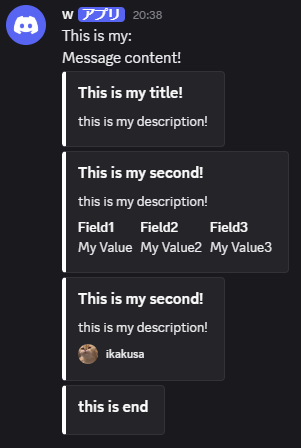

# A basic Discord Webhook wrapper using winhttp
requires C++17

requires [nlohmann::json](https://github.com/nlohmann/json)

# Example

```cpp
#include <iostream>
#include "Discord.h"

int main()
{
    //Setup
    Discord discord = Discord("https://discord.com/api/webhooks/...");
    discord.username.set("ika286");
    discord.avatar.set("https://avatars.githubusercontent.com/u/182407710?v=4&size=64");

    //Example Embed
    Embed embed1;
    embed1.setTitle("This is my title!")
        .setDescription("this is my description!")
        .setColor("#ffffff");

    //name, value, inline
    Embed embed2;
    embed2.setTitle("This is my second!")
          .setDescription("this is my description!")
          .setColor("#ffffff")
          .addField("Field1", "My Value", true)
          .addField("Field2", "My Value2", true)
          .addField({
              { "name", "Field3" },
              { "value", "My Value3" },
              { "inline", true }
          });

    Embed embed3;
    embed3.setTitle("This is my third!")
          .setDescription("this is my description!")
          .setColor("#ffffff")
          .setFooter("ikakusa", "https://avatars.githubusercontent.com/u/182407710?v=4&size=64")
          .setTimestamp(); //timestamp!
    
    //Add Multiple Embeds
    EmbedBuilder builder;
    builder.addEmbed(embed1);
    builder.addEmbed(embed2);
    builder.addEmbed(embed3);

    //Message::embed function requires Embed class
    //Message::addEmbeds function requires EmbedBuilder class
    Message message("This is my:\nMessage content!");
    message.addEmbeds(builder)
        .embed(Embed().setTitle("this is end").setColor("#ffffff"))
        .addPoll(Poll("My Poll", true).addAnswer("Answer 1", "😡").addAnswer("Answer with emoji", "😡").setDuration(16));

    if (discord.sendWebhook(message, DiscordFormData())) {
        printf("sent to webhook!!!!!!");
    };
}
```

# Preview


# TODO

- [x] Timestamp
- [ ] FormData::add_image()
- [x] Poll
- [ ] Poll answer with emoji